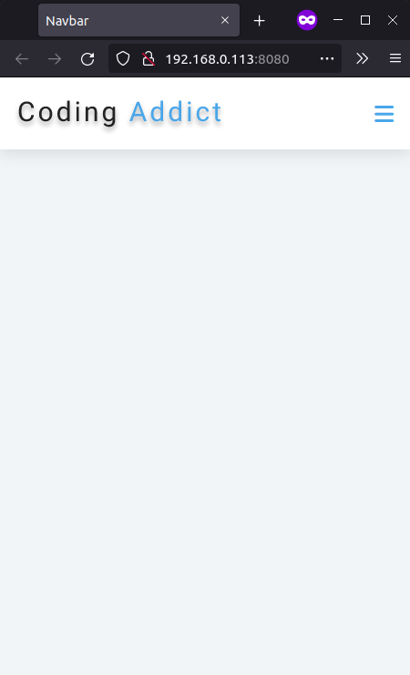
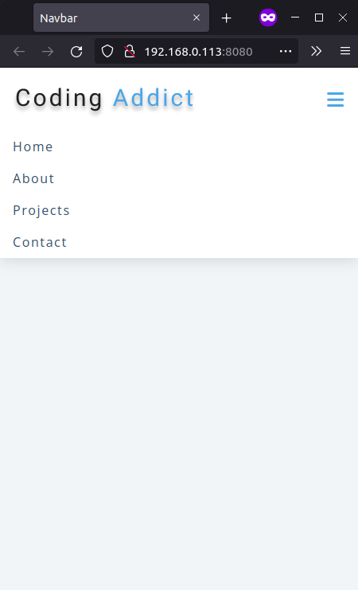

# Navbar

## Description

In this project a navigation menu, which becomes a sandwich menu on devices with small screens, was created. Then, JS was used to control the menu display.

## Takeaway

Altough we can use classList.contains() in combination with classList.add()/classList.remove() to control the display of a Node, there's the classList.toggle() function which can be used to provide the same result.

## Screenshots

| Menu hidden                                           | Menu shown                                           |
| ----------------------------------------------------- | ---------------------------------------------------- |
|  |  |

## Credits

The original project can be found at [Build 15 JavaScript Projects - Vanilla JavaScript Course](https://www.youtube.com/watch?v=3PHXvlpOkf4&t=4289s)
